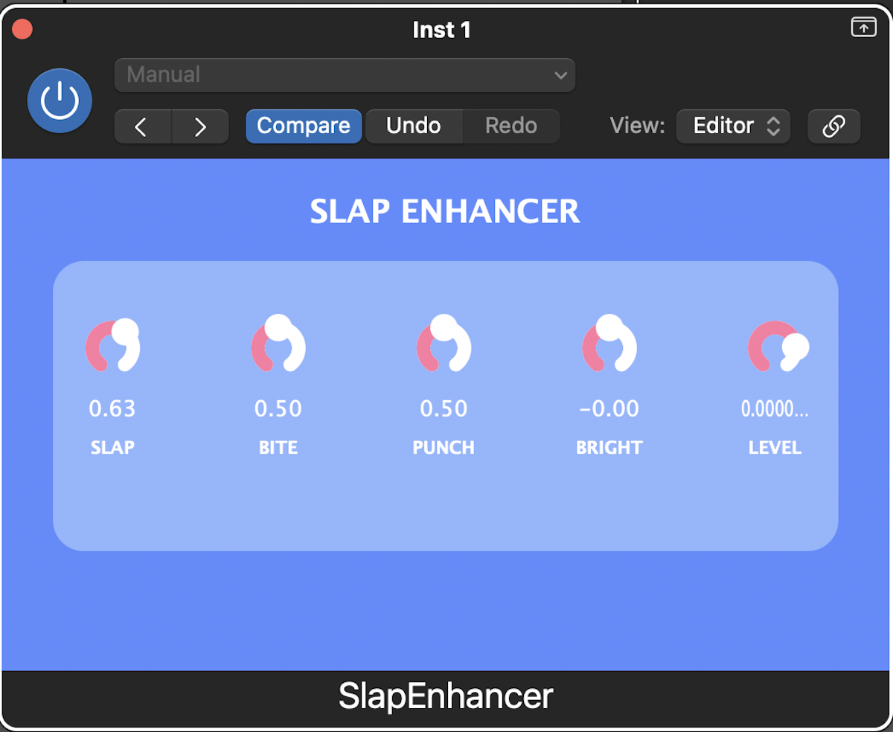

 SlapEnhancer 

**SlapEnhancer** is a toy-style audio effect plugin designed to make slap house basses more punchy, bright, and percussive.

Built using **JUCE** and **C++**, the plugin focuses on transient enhancement, harmonic bite, and controlled punch while keeping a fun, minimal UI.

---

Features
- Transient "Slap" enhancer
- Harmonic saturation (Bite)
- Punch control
- Brightness tilt
- Output level control
- Toy-style blue / white / pink UI
- Smooth rotary controls

---

 Built With
- **C++**
- **JUCE Framework**
- **Digital Signal Processing (DSP)**
- **Audio Units (AU)**

---

 Tested In
- Logic Pro (AU)

---

 Screenshot

---

 How To Build
1. Open `SlapEnhancer.jucer` in **Projucer**
2. Export project
3. Open generated project in Xcode
4. Build AU target

---

